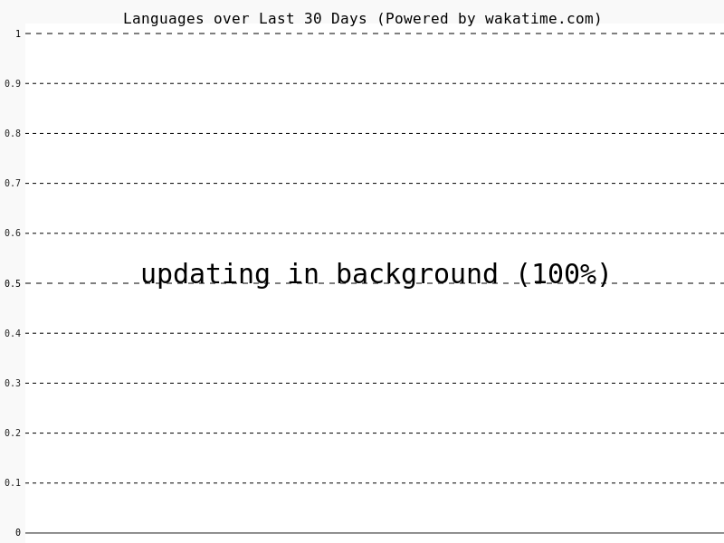

# MSG087

## Data Scientist

Welcome to my GitHub profile! I'm passionate about data science and data engineering and love to share what I can with the community. 
Below you'll find my coding activity stats and some of my experiments with GitHub Actions.

### My Coding Activity

To give you an idea of how I spend my time coding, here's a snapshot of my Wakatime statistics:

_Last Updated: 2024-02-03 19:10:50 EST_

This chart is automatically updated using a GitHub Action to ensure it reflects my most recent coding activity.

### Exploring GitHub Actions

I'm currently exploring the power of GitHub Actions to automate workflows and enhance productivity. Stay tuned for updates on this journey!
I plan to do the following with GitHub Actions:
1. [x] Automatically update my coding activity chart
2. [ ] Automatically update a replica postgres database whenever I push to my main database
    - This will allow me to have a replica database that I can use for development purposes
    - I believe this will be a great way to ensure that my test environment is as close to my production environment as possible
3. [ ] Explore connections to my Apache Airflow instance, and see if I can trigger DAGs from GitHub Actions
    - This will allow me to test more complex pipelines whenever someone pushes code to ensure that all my pipelines are working as expected

#### 💬 Feedback

I'm always open to connecting with fellow developers and data enthusiasts. If you have any questions, suggestions, or just want to say hello, feel free to reach out!

